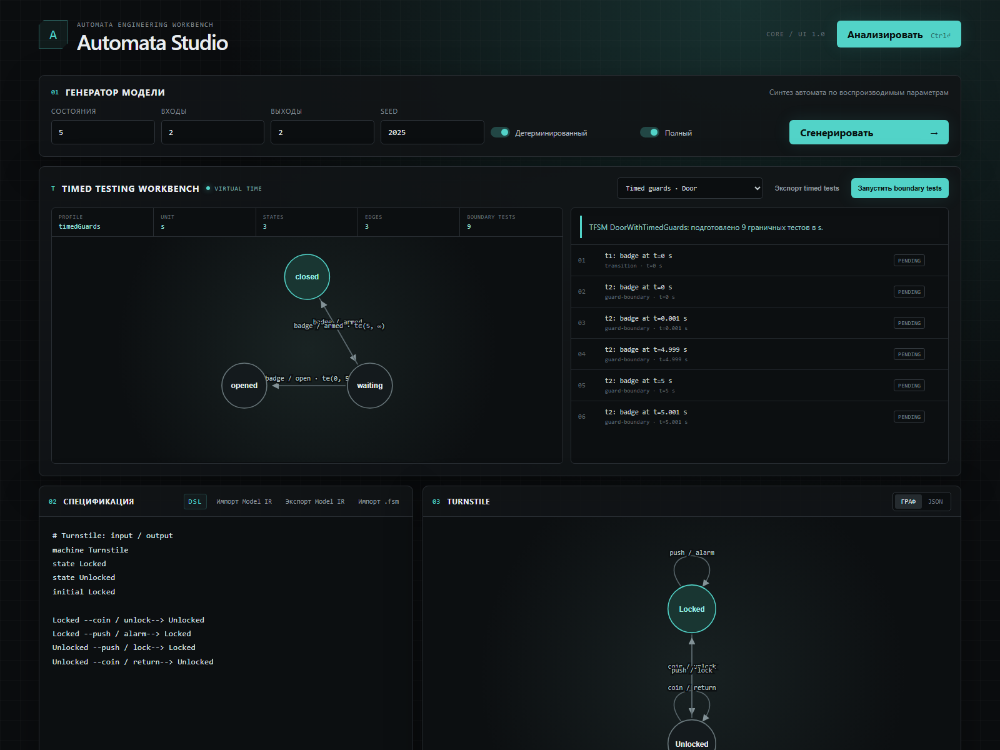

# Automata Studio

[English](README.md) | [Русский](README.ru.md)

[](https://github.com/vitalya834/automata-studio/actions/workflows/ci.yml)
[](https://vitalya834.github.io/automata-studio/)
[](https://github.com/vitalya834/automata-studio/releases)
[](LICENSE)

**Создавайте модели поведения, генерируйте тестовые кампании, запускайте их на
реальных программах или устройствах и сохраняйте доказательства проверки.**

[Открыть браузерную лабораторию](https://vitalya834.github.io/automata-studio/) ·
[Запустить полное HTTP-демо](#пятиминутное-знакомство) ·
[English README](README.md)



Automata Studio — гибридная C++/TypeScript-платформа модельного тестирования.
Она генерирует модели конечных автоматов по воспроизводимым ограничениям,
импортирует старый формат `.fsm`, проверяет свойства автоматов, синтезирует
тестовые наборы и показывает модели и тесты в виде графов и JSON.

Это независимый от протокола движок для тестирования программ, сервисов,
встраиваемых систем и физических устройств. Граф является представлением, а
формальная семантика, тестовый оракул, воспроизводимое выполнение и покрытие —
ядром продукта. Один абстрактный тест-план можно выполнять на симуляторе,
CLI-процессе, HTTP-сервисе, Modbus/CAN-устройстве или другом SUT через адаптер.

## Быстрый старт

```powershell
npm install
npm run dev
```

Откройте локальный адрес, который напечатает Vite. При первом посещении тур
объяснит четыре этапа: **Model → Generate → Run → Report**. Тур можно пропустить
и снова открыть кнопкой **Tour / Обзор**; локально сохраняется только признак
закрытия, без учётных данных.
Переключатель **RU / EN** переводит весь интерфейс. Компактная закреплённая
панель ведёт прямо к Start, Model, Timed, Editor, Tests или Run и превращается
из шести колонок на компьютере в удобную сенсорную сетку на малом экране.

## Windows-приложение v1.3

Пошаговый x64-установщик и Portable-файл без установки доступны в
[GitHub Releases](https://github.com/vitalya834/automata-studio/releases/latest).
Изолированная desktop-оболочка содержит лабораторию и ресурсы runner и не
требует установленного Node.js. Первые файлы v1.3 ещё не подписаны сертификатом
Authenticode, поэтому перед запуском сверяйте SHA-256. Подробности находятся в
[руководстве по desktop-версии](docs/DESKTOP.ru.md).

## Двуязычный адаптивный интерфейс v1.2

- полное переключение RU/EN для кнопок, шаблонов, диагностики, анализа,
  временных тестов, выполнения и отчётов;
- выбранный язык сохраняется локально и восстанавливается при следующем входе;
- вместо длинной стопки карточек используются шесть компактных вкладок;
- закреплённая навигация избавляет от прокрутки одной длинной страницы;
- раскладка для компьютера, планшета и телефона не создаёт горизонтальной
  прокрутки страницы.

## Пятиминутный учебный сценарий

1. **Model (1-я минута):** выберите карточку в разделе **Start testing** и
   нажмите **Use template / Открыть**. Все шесть карточек загружают канонический
   Model IR — редактировать JSON вручную не нужно.
2. **Изучение (2-я минута):** посмотрите граф состояний, DSL и свойства модели.
   Шаблоны REST, Modbus, CLI, временной двери, игры/NPC и ML явно описывают цель
   тестирования и рекомендуемую стратегию.
3. **Generate (3-я минута):** для Mealy-модели сразу готовится transition-cover
   кампания, для временной модели — случаи до, на и после границ guard.
4. **Run (4-я минута):** нажмите **Запустить в симуляторе**. Для настоящего CLI,
   HTTP или Modbus SUT скопируйте команду Node runner из карточки.
5. **Report (5-я минута):** изучите трассу шагов и verdict в браузере. Флаги из
   документации [Отчёты](docs/REPORTS.ru.md) сохраняют JSON, JUnit XML и
   автономный HTML для CI.

## Онбординг и галерея шаблонов v1.1

- веб-лаборатория открывается разделом «Start testing / Начать тестирование»
  для тех, кто ещё не знает терминологию FSM;
- шесть готовых сценариев-карточек: игровой автомат, REST API, устройство
  Modbus TCP, ML-сервис инференса, временной контроллер и CLI-приложение;
- каждая карточка объясняет, что тестируется, какие состояния, входы и выходы
  использует модель, какой адаптер нужен и какую реальную команду выполнить;
- каждая карточка одним кликом загружает проверенную каноническую модель;
  Mealy-сценарии готовят transition-cover кампанию, а временная дверь —
  граничные тесты в Timed Testing Workbench;
- реальные команды `npm run` и ссылки остаются доступны для Node-only
  выполнения через HTTP, Modbus и CLI;
- закрываемый тур объясняет Model → Generate → Run → Report и открывается
  повторно, не сохраняя учётные данные;
- каталог шаблонов и логика выбора вынесены в типизированный модуль
  (`src/onboarding.ts`) с unit-тестами: каждая команда, файл и ссылка на
  карточках проверяются на существование в репозитории.

## Пятиминутное знакомство

Требуются Node.js 24 и npm.

```powershell
git clone https://github.com/vitalya834/automata-studio.git
cd automata-studio
npm install
npm run demo:http
```

Демо читает FSM игры, генерирует transition-cover тесты, запускает временный
HTTP-сервер, выполняет все пути и создаёт JUnit/HTML-отчёты. Оно не устанавливает
системные службы и не подключается к внешним устройствам.

| Цель | Команда или руководство |
| --- | --- |
| Посмотреть модели и временные автоматы | [Браузерное демо](https://vitalya834.github.io/automata-studio/) |
| Проверить консольную программу | `npm run demo:cli` |
| Безопасно проверить Modbus TCP | `npm run demo:modbus` |
| Сгенерировать случайные тесты | [Генерация тестов](docs/TEST-GENERATION.ru.md) |
| Проверить REST или ML inference API | [HTTP-адаптер](docs/adapters/HTTP.ru.md) |
| Проверить реальный внешний продукт | `npm run demo:github` |
| Создать данные последовательностей | [Генерация датасетов](docs/DATASET-GENERATION.ru.md) |

## Продуктовый конвейер v1.0

- единый CLI поддерживает команды `generate`, `validate` и `run`;
- модель DSL преобразуется в версионированный Test Plan IR методами
  transition-cover или воспроизводимого random-walk;
- случайные кампании содержат эталонные выходы, трассы состояний, метаданные
  переходов, лимиты случаев/шагов и дедлайны;
- HTTP-демо доказывает полный цикл: модель → генерация тестов → реальный SUT →
  JUnit/HTML-отчёты;
- сгенерированный план не зависит от протокола и запускается через CLI, Modbus
  или HTTP-адаптер.

## Возможности v0.9

- HTTP/REST-адаптер для API, микросервисов, игровых серверов и ML inference;
- настраиваемые reset и отображение входов в запросы с выбором результата через
  JSON Pointer, текст или HTTP-статус;
- контроль origin, запрет redirect, ограничение ответа и передача дедлайна;
- настоящее loopback-демо игрового сервиса для start, pause, resume и victory;
- воспроизводимый генератор JSONL-переходов для последовательностных моделей и
  задач предсказания следующего состояния/выхода;
- готовые примеры тест-планов для игр и ML и двуязычная документация.

## Возможности v0.8

- детерминированные JUnit XML и автономные HTML evidence reports;
- один testcase на случай Test Case IR, вердикты и полные трассы шагов;
- защита XML/HTML от враждебных строк модели и SUT;
- флаги `--junit`, `--html` и `--report` создают все форматы за один запуск;
- статический HTML без scripts, внешних ресурсов и event handlers;
- GitHub Actions CI проверяет тесты, сборки, C++ и обе end-to-end демонстрации.

## Возможности v0.7

- запускаемый Node.js runner: проверка планов, внешние SUT, text/JSON-трассы,
  файлы отчётов и exit codes для CI;
- настоящий Modbus TCP‑адаптер: FC1–FC6, MBAP transaction ID, фрагментация TCP
  и отображение значений в абстрактные символы;
- неразрушающий reset и обязательный `allowWrites: true` для любой записи;
- loopback‑симулятор и сквозная демонстрация `npm run demo:modbus`;
- строгая длина ответов, дедлайны, отмена и закрытие sockets;
- Modbus‑адреса хранятся в адаптере, а Test Plan IR остаётся независимым.

## Возможности v0.6

- Node.js-адаптер для тестирования внешних программ через строгий протокол
  JSON Lines по stdin/stdout;
- жизненный цикл процесса, тайм-ауты ответа, отмена и детерминированный reset;
- прямой запуск executable без shell и явный список разрешённых переменных
  окружения;
- ограничение размера строк и stderr, request ID и отклонение ошибочных ответов;
- выполнение Test Plan IR на настоящем дочернем процессе;
- запускаемый terminal runner с валидацией, text/JSON, exit codes для CI и
  сохранением полного отчёта;
- 100 автоматических TypeScript-тестов и проверки C++-ядра/runner.

Браузер не может запускать локальные программы из-за своей модели безопасности.
CLI-адаптер работает как Node.js API и использует тот же `runTestPlan`, что и
видимая панель выполнения в браузере.

## Временное тестирование v0.5

- визуальная лаборатория TFSM с пятью профилями;
- виртуальное время для временных guards, тайм-аутов состояний, задержек выхода
  и комбинированных моделей;
- генерация граничных тестов для открытых и закрытых границ интервалов;
- вердикты PASS, FAIL, EARLY, LATE, TIMEOUT и INVALID;
- постоянные, интервальные и линейно зависящие от времени задержки;
- экспорт временных кампаний в JSON;
- визуализация Alur–Dill без некорректной имитации zone/region engine.

## Основа продукта

- канонический Model IR 1.0 для Mealy, Moore, EFSM и пяти TFSM-профилей;
- Test Plan IR с JSON Schema и стабильной сериализацией;
- текстовый DSL и восстановленный формат `F/s/i/o/n0/p`;
- воспроизводимая генерация детерминированных и недетерминированных Mealy FSM;
- анализ полноты, детерминизма, алфавитов и достижимости;
- transition-cover тесты с кратчайшими путями доступа;
- TypeScript и C++20 runner, трассы, дедлайны и отмена;
- интерактивные графы, JSON, диагностика и экспорт тестов.

Transition cover является структурным покрытием, а не гарантией полной
конформности. W/Wp/H/HSI и другие методы добавляются отдельно с явными
предусловиями.

## Запуск веб-лаборатории

```powershell
npm install
npm run dev
```

Откройте локальный адрес, который выведет Vite.

## Проверка

```powershell
npm test
npm run build
npm run cpp:test
npm run cpp:build
```

## C++ CLI

После `npm run cpp:build`:

```powershell
.\build-cpp\fsm-cli.exe parse examples\turnstile.fsm
.\build-cpp\fsm-cli.exe analyze examples\turnstile.fsm
.\build-cpp\fsm-cli.exe cover examples\turnstile.fsm
.\build-cpp\fsm-cli.exe generate --name Demo --states 8 --inputs 3 --outputs 2 --seed 2025
```

## Runner для внешнего SUT

```powershell
npm run cli -- generate examples/game-session.fsm -- --strategy transition-cover --output game-plan.json
npm run cli -- generate examples/game-session.fsm -- --strategy random-walk --cases 50 --max-steps 25 --seed 2026 --output game-fuzz.json
npm run cli -- validate examples/test-plans/turnstile-transition-cover.json
npm run demo:cli
npm run demo:modbus
npm run demo:http
npm run demo:github
```

Настройка executable, allowlist окружения, JSON и файлы отчётов описаны в
[документации runner CLI](docs/RUNNER-CLI.ru.md).

## Документация

- [Двуязычный индекс документации](docs/README.ru.md)
- [Архитектура продукта](docs/PRODUCT-ARCHITECTURE.ru.md)
- [Таксономия автоматов](docs/AUTOMATA-TAXONOMY.ru.md)
- [Архитектура выполнения тестов](docs/TEST-EXECUTION.ru.md)
- [Генерация transition-cover и random-walk тестов](docs/TEST-GENERATION.ru.md)
- [Временное тестирование](docs/TIMED-TESTING.ru.md)
- [Runner CLI для внешних SUT](docs/RUNNER-CLI.ru.md)
- [Modbus TCP‑адаптер](docs/adapters/MODBUS-TCP.ru.md)
- [HTTP/REST-адаптер для игр и ML](docs/adapters/HTTP.ru.md)
- [Генерация последовательностей FSM для датасетов](docs/DATASET-GENERATION.ru.md)
- [JUnit и HTML‑отчёты](docs/REPORTS.ru.md)
- [CLI Process SUT Adapter](docs/adapters/CLI-PROCESS.ru.md)

Восстановленное Java-приложение 2010 года хранится вне репозитория в
`D:\FSMTest-Recovered-2010`. Оно используется для исследования поведения и не
распространяется, поскольку его лицензия и происхождение не установлены.
